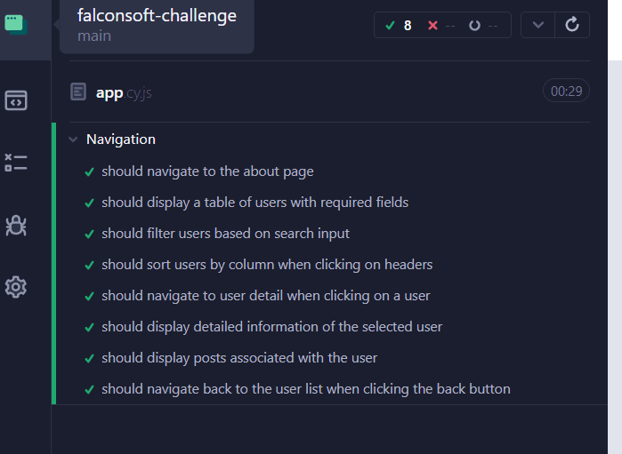
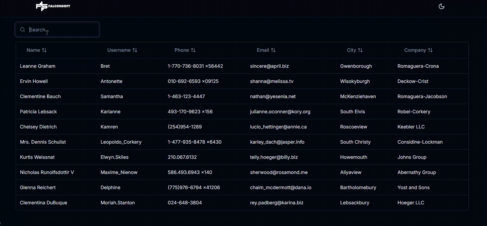
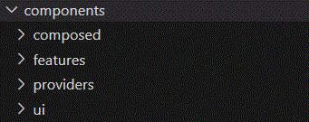

<details>
<summary>Recruiting Exercise - FrontEnd Developer - Reactjs</summary>

## Perfil

**React FrontEnd Developer**

## Objetivo

El ejercicio apunta a demostrar el conocimiento de React y algunas de las capacidades esenciales para el desarrollo de aplicaciones de gestión e inteligencia de negocio. Entre ellas:

- Diseño enfocado en UI modernas y UX.
- Estructuración de módulos y clases.
- Optimización de performance y manejo de recursos.
- Claridad del código fuente.

## Descripción

Crear una aplicación React que consuma la API de JSONPlaceholder para mostrar usuarios y sus posts asociados, implementando navegación, filtrado y visualización de detalles.

## Requerimientos Funcionales

### 1. Lista de Usuarios

- Crear una tabla que muestre la información de los usuarios.
- **Campos requeridos**:
  - Nombre
  - Nombre de usuario
  - Teléfono
  - Email
  - Ciudad
  - Nombre de la empresa
- Implementar un buscador que filtre por nombre, usuario, email y empresa.
- Los registros deben ser clickeables para redireccionar al detalle del usuario.
- Implementar ordenamiento en las columnas de la tabla (clickeando en los headers).

### 2. Detalle de Usuario

- Mostrar la información detallada del usuario seleccionado.
- Implementar la carga de posts asociados al usuario.
- Mostrar los posts en un formato de tarjetas con título y contenido.
- Agregar un botón para volver a la lista de usuarios.

## Requerimientos Técnicos

### Estructura y Organización

- Utilizar **React Router** para la navegación.
- Manejar estados y efectos apropiadamente.
- Estructurar el código de manera modular y reutilizable.

### Manejo de Datos

- Consumir los siguientes endpoints:
  - `GET /users`
  - `GET /users/:id`
  - `GET /users/:id/posts`
- Implementar manejo de errores y estados de carga.
- Utilizar `async/await` para las llamadas a la API.

### APIs

```http
// Usuarios
GET https://jsonplaceholder.typicode.com/users
GET https://jsonplaceholder.typicode.com/users/:id

// Posts
GET https://jsonplaceholder.typicode.com/users/:id/posts
```

## Entregables

❏ Aplicación compilada  
❏ Código fuente compilable  
❏ Instrucciones de ejecución

</details>

---

<details open>
<summary>Instrucciones de ejecución</summary>

1. Clonar el repositorio
2. Ejecutar `pnpm install` o `npm install`
3. Ejecutar `pnpm dev` o `npm run dev`

</details>

<details open>
<summary>Instrucciones de pruebas con Cypress</summary>

1. Ejecutar `npm run cypress:open` o `pnpm cypress:open`
2. Seleccionar el archivo `app.cy.js`
3. Ejecutar las pruebas

</details>

<details open>
<summary>Decisiones tecnicas</summary>

**Frameworks y librerías**

- **Next.js**: Se utilizó Next.js para la aplicación, ya que es un framework que facilita la creación de aplicaciones web con renderizado del lado del servidor y optimización automática.
- **TailwindCSS**: Se utilizó TailwindCSS para el diseño de la aplicación, ya que permite un desarrollo rápido de interfaces responsivas mediante clases utilitarias.
- **Shadcn/UI**: Se utilizó Shadcn/UI para los componentes de la aplicación, proporcionando una colección de componentes accesibles y personalizables que mejoran la experiencia del usuario.
- **Tanstack Table**: Se utilizó Tanstack Table para la tabla de usuarios, ya que ofrece una solución flexible y eficiente para manejar grandes conjuntos de datos en tablas.
- **Cypress**: Se utilizó Cypress para las pruebas de la aplicación, permitiendo realizar pruebas end-to-end de manera sencilla y efectiva, asegurando la calidad del software.

**Notas**

- **TESTING E2E** cubierto al 100%



- **DEBOUNCE** Implemente una caja da busqueda por name, username, email y company (no ciudad ni telefono, ya que no lo pedia en los requisitos) con una funcion DEBOUNCE para que recien se filtre cuando el usuario deja de escribir y asi evitar renderizados innecesarios.



- **ESTRUCTURAS DE CARPETAS** uso uno que se conoce como "features" (un poco modificada ) esta siendo bastante populares debido a que da mucha escalabilidad y es muy mantenible (https://github.com/alan2207/bulletproof-react/blob/master/docs/project-structure.md)

- **COMPONENTES** divididos en ui, composed, features y providers.



- **REACT ROUTER** uno use REACT ROUTER ya que al usar next.js no es necesario usar react router ya que tiene su propio router.

- **AXIOS** Uso axios para las peticiones a la API y cree un interceptor tambien.

- **ENV** deje el env.local en el repositorio para que se pueda ejecutar la aplicación sin problemas.

</details>
</details>
